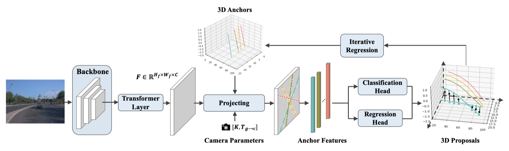
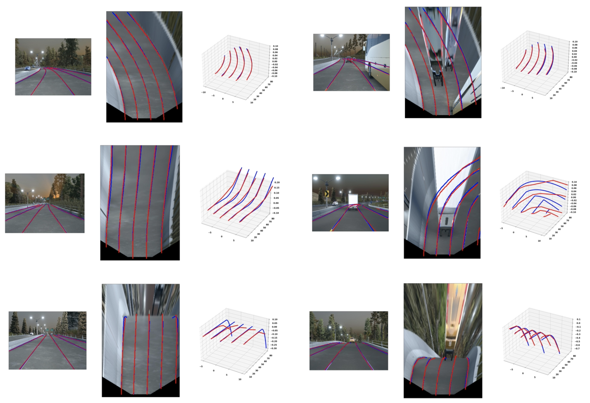
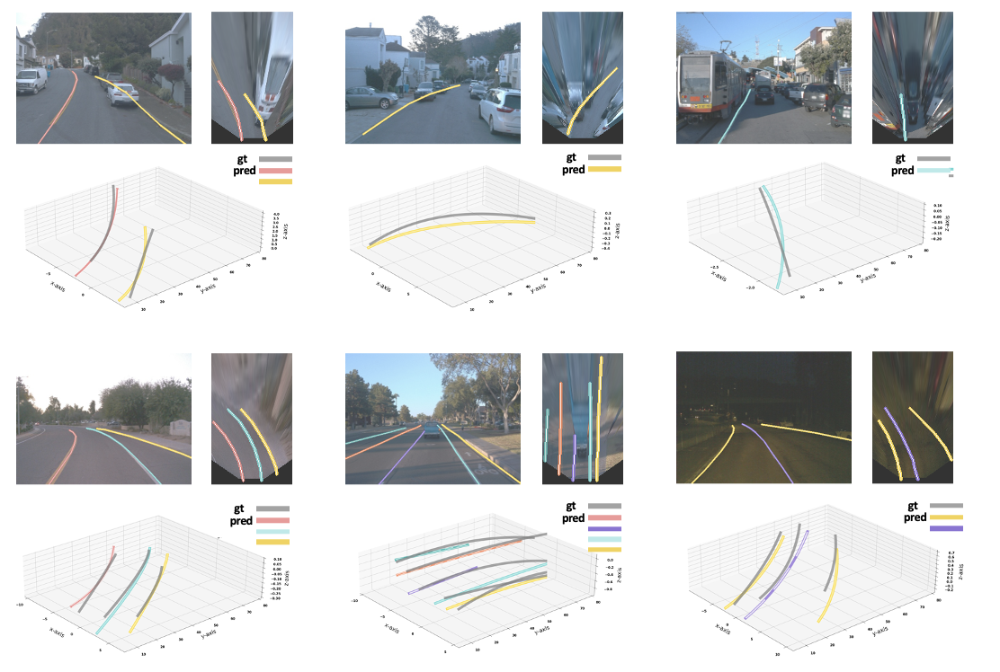
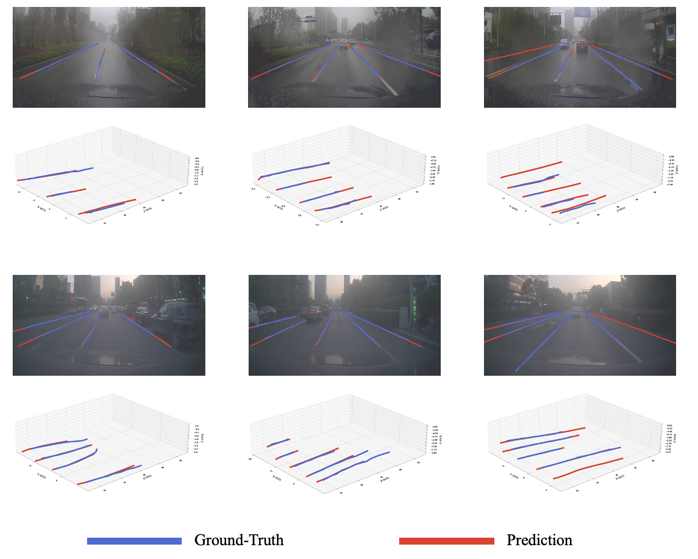

# Anchor3DLane
This repo is the official PyTorch implementation for the following papers:

[Anchor3DLane: Learning to Regress 3D Anchors for Monocular 3D Lane Detection](https://arxiv.org/abs/2301.02371). Accepted by CVPR 2023.
[Anchor3DLane++: 3D Lane Detection via Sample-Adaptive Sparse 3D Anchor Regression](https://arxiv.org/pdf/2412.16889). Accepted by TPAMI 2024.


In this paper, we define 3D lane anchors in the 3D space and propose a BEV-free method named Anchor3DLane to predict 3D lanes directly from FV representations. 3D lane anchors are projected to the FV features to extract their features which contain both good structural and context information to make accurate predictions. We further extend Anchor3DLane to the multi-frame setting to incorporate temporal information for performance improvement.

## Update
- [2025/05/28] We have added the code of Anchor3DLane++ in the [```anchor3dlane++``` branch](https://github.com/tusen-ai/Anchor3DLane/tree/anchor3dlane++).
- [2023/06/02] We have added the code to generate data lists in the data conversion tools.
- [2023/06/15] We have supported testing with multiple GPUs.
- [2024/04/02] We have released checkpoints of the single-frame Anchor3DLane on the latest version of Openlane dataset.

## Installation
---

#### **Step 1.** Create a conda virtual environment and activate it
```
conda create -n lane3d python=3.7 -y
conda activate lane3d
conda install pytorch==1.9.1 torchvision==0.10.1 cudatoolkit=11.1 -c pytorch -y
```

#### **Step 2.** Install dependencies
```
pip install -U openmim
mim install mmcv-full
pip install -r requirements.txt
```
Refer to [ONCE-3dlane](https://github.com/once-3dlanes/once_3dlanes_benchmark/tree/master/wheels) to install `jarvis`.

#### **Step 3.** Install Anchor3DLane
```
git clone https://github.com/tusen-ai/Anchor3DLane.git
cd Anchor3DLane
python setup.py develop
```
Compile multi-scale deformable attention:
```
cd mmseg/models/utils/ops
sh make.sh
```

This repo is implemented based on [open-mmlab mmsegmentation-v0.26.0](https://github.com/open-mmlab/mmsegmentation/tree/v0.26.0). Refer to [here](https://github.com/open-mmlab/mmsegmentation/blob/v0.26.0/docs/en/get_started.md#installation) for more detailed information of installation.

## Data Preparation
The data folders are organized as follows:
```
├── data/
|   └── Apollosim
|       └── data_splits  
|           └── standard
|               └── train.json
|               └── test.json
|           └── ...
|       └── data_lists/...
|       └── images/...
|       └── cache_dense/...  # processed lane annotations
|   └── OpenLane
|       └── data_splits/...  
|       └── data_lists/...   # list of training/testing data
|       └── images/...
|       └── lane3d_1000/...  # original lane annotations
|       └── cache_dense/...  
|       └── prev_data_release/...  # temporal poses
|       └── lidar/...  # LiDAR points
|   └── ONCE/
|       └── raw_data/  # camera images
|       └── annotations/  # original lane annotations
|           └── train/...
|           └── val/...
|       └── data_splits/...  
|       └── data_lists/... 
|       └── cache_dense/
```
Note: For the data_lists files, you can generate it by running our data conversion tools as mentioned below. We also provide the  data lists we used in the `data/` folder of this repo.

### ApolloSim
**1.** Download dataset from [ApolloSim Dataset](https://github.com/yuliangguo/3D_Lane_Synthetic_Dataset) and organize the data folder as mentioned above.

**2.** Change the data path in `apollosim.py` and generate annotation pickle files by running:
```
cd tools/convert_datasets
python apollosim.py [apollo_root]
```

### OpenLane
**1.** Refer to [OpenLane Dataset](https://github.com/OpenDriveLab/OpenLane) for data downloading and organize the data folder as mentioned above.

**2.** Merge annotations and generate pickle files by running:
```
cd tools/convert_dataset
python openlane.py [openlane_root] --merge
python openlane.py [openlane_root] --generate
```

**(optional) 3.** If you wish to run the multi-frame experiments, you need to download the cross-frame pose data processed by us from [Baidu Drive](https://pan.baidu.com/s/1fxwyLeueTQKg6iBhFeIAog?pwd=7qkx).

We also provide the cross-frame pose extraction script at `tools/convert_dataset/openlane_temporal.py` to allow customized use. 
You can fetch the raw pose data link at [Baidu Drive](https://pan.baidu.com/s/1bgLSgO9wiypOsjNjRKcJZA?pwd=69mh) or extract the raw pose data with tools provided in [save_pose()](https://github.com/fundamentalvision/BEVFormer/blob/master/tools/data_converter/waymo_converter.py#L353).

**(optional) 4.** For the camera-LiDAR fusion settings in Anchor3dlane++, we also provide LiDAR data([Baidu Drive](https://pan.baidu.com/s/1fxwyLeueTQKg6iBhFeIAog?pwd=7qkx)), which is extracted from the original [Waymo dataset](https://waymo.com/open/). If you would like to conduct multi-sensor fusion experiments, you can download the corresponding data from the provided link.

### ONCE-3DLane
**1.** Refer to [ONCE-3DLane Dataset](https://github.com/once-3dlanes/once_3dlanes_benchmark) for data downloading and organize the data folder as mentioned above.

**2.** Merge annotations and generate pickle files by running the following commands:
```
cd tools/convert_dataset
python once.py [once_root] --merge
python once.py [once_root] --generate
```

## Model Zoo
We provide the pretrained weights of Anchor3DLane and Anchor3DLane+(w/ iterative regression) on ApolloSim-Standard and ONCE-3DLane datasets. 
For OpenLane dataset, we additional provide weights for Anchor3DLane-T+(with multi-frame interaction).

### ApolloSim

Model | F1 | AP | x error close/m | x error far/m | z error close/m | z error far/m | Baidu Drive Link
--- |:---:|:---:|:---:|:---:|:---:|:---:|---:
Anchor3DLane | 95.6 | 97.2 | 0.052 | 0.306 | 0.015 | 0.223 | [download](https://pan.baidu.com/s/1HPYxsNNSOO5CY7-RwAt9cw?pwd=bqvy)
Anchor3DLane-Iter | 97.1 | 95.4 | 0.045 | 0.300 | 0.016 | 0.223 | [download](https://pan.baidu.com/s/1f4Ssts_cUU7kGtXUyRulLA?pwd=pfe5)


### OpenLane

#### Results on OpenLane-v1.1.

Model | Backbone | F1 | Cate Acc | x error close/m | x error far/m | z error close/m | z error far/m | Baidu Drive Link
--- |:---:|:---:|:---:|:---:|:---:|:---:|:---:|---:
Anchor3DLane | ResNet-18 | 53.1 | 90.0 | 0.300 | 0.311 | 0.103 | 0.139 | [download](https://pan.baidu.com/s/1doS4NzNdxjjuKLTazVvQFw?pwd=b7b5)
Anchor3DLane | EfficientNet-B3 | 56.0 | 89.0 | 0.293 | 0.317 | 0.103 | 0.130 | [download](https://pan.baidu.com/s/1NYTGmaXSKu28SvKi_-DdKA?pwd=8455)
Anchor3DLane-Iter | ResNet-18 | 53.7 | 90.9 | 0.276 | 0.311 | 0.107 | 0.138 | [download](https://pan.baidu.com/s/1n1kzIWKCEY9VOBuyi5RU_g?pwd=ew8k)
Anchor3DLane-Iter-T | ResNet-18 | 54.3 | 90.7 | 0.275 | 0.310 | 0.105 | 0.135 | [download](https://pan.baidu.com/s/1aEzaqONTa93xQlacQL_N8g?pwd=ymk2)

Note: We use an earlier version of the Openlane dataset in our paper, whose annotations are significantly inconsistent in lane points' coordinates with the latest version as mentioned in [this issue](https://github.com/OpenDriveLab/OpenLane/issues/59).
Thus, it is normal if you cannot obtain the performances reported in our paper by testing the checkpoints we provided on the latest OpenLane validation set. But you can still reproduce the performances by training on the training set of the latest version.

#### Results of Openlane-v1.2.
We also provide checkpoints of single-frame settings on the latest Opanlane dataset for validation.

**Camera only:**

Model | Backbone | Resolution | F1 | Cate Acc | x error close/m | x error far/m | z error close/m | z error far/m | Baidu Drive Link
--- |:---:|:---:|:---:|:---:|:---:|:---:|:---:|:---:|---:
Anchor3DLane | ResNet-18 | 360x480 | 53.1 | 88.9 | 0.269 | 0.293 | 0.079 | 0.111 | [download](https://pan.baidu.com/s/14JmWTcX6UgImS90o9cq9fg?pwd=mhff)
Anchor3DLane-Iter | ResNet-18 | 360x480 | 53.6 | 89.8 | 0.272 | 0.292 | 0.085 | 0.116 | [download](https://pan.baidu.com/s/1Hu0P5OPuvRJnLQjHW_-PgA?pwd=t6ba)
Anchor3DLane-Iter | ResNet-50 | 720x960 | 57.5 | 91.9 | 0.229 | 0.243 | 0.079 | 0.106 | [download](https://pan.baidu.com/s/14LID1kvzyllLDnIblaXXTw?pwd=yz2b)
Anchor3DLane++ | ResNet-18 | 360x480 | 57.9 | 91.4 | 0.232 | 0.265 | 0.076 | 0.102 | [download](https://pan.baidu.com/s/1_7z3BdAOmE7uekB0-g9SsQ?pwd=bkvj)
Anchor3DLane++ | ResNet-50 | 360x480 | 59.4 | 92.6 | 0.227 | 0.244 | 0.075 | 0.100 | [download](https://pan.baidu.com/s/1jte4uP6qV2Kz5JAy8iLEOg?pwd=d9a2)
Anchor3DLane++ | ResNet-50 | 720x960 | 62.4 | 93.4 | 0.202 | 0.237 | 0.073 | 0.100 | [download](https://pan.baidu.com/s/1p3utwpYCBCi2G1ci172V1w?pwd=3yi5)

**Camera-LiDAR fusion:**

Model | Image Backbone | LiDAR Encoder | Image Resolution | F1 | Cate Acc | x error close/m | x error far/m | z error close/m | z error far/m | Baidu Drive Link
--- |:---:|:---:|:---:|:---:|:---:|:---:|:---:|:---:|:---:|---:
Anchor3DLane++ | ResNet-18 | SECOND | 360x480 | 59.8 | 92.6 | 0.167 | 0.170 | 0.035 | 0.060 | [download](https://pan.baidu.com/s/1NilOdzhK8DA2ZQMmMwquvw?pwd=k4m6)
Anchor3DLane++ | ResNet-50 | SECOND | 360x480 | 61.4 | 92.9 | 0.149 | 0.160 | 0.033 | 0.058 | [download](https://pan.baidu.com/s/1cOOJdOeH6dQGtALyHnW-Yw?pwd=9wcb)
Anchor3DLane++ | ResNet-50 | SECOND | 720x960 | 62.9 | 93.6 | 0.134 | 0.137 | 0.033 | 0.057 | [download](https://pan.baidu.com/s/1tfcVI_AbZN4EhL4auH2ZZw?pwd=hna3)
Anchor3DLane++ | ResNet-18 | PointPillars | 360x480 | 60.0 | 92.5 | 0.164 | 0.177 | 0.049 | 0.082 | [download](https://pan.baidu.com/s/1dcuNYGEI86Mot2f1wAFXhw?pwd=t5nv)
Anchor3DLane++ | ResNet-50 | PointPillars | 360x480 | 61.1 | 93.1 | 0.147 | 0.165 | 0.055 | 0.091 | [download](https://pan.baidu.com/s/1etYo-C5zvdvPJQTfacqwtA?pwd=xhrx)
Anchor3DLane++ | ResNet-50 | PointPillars | 720x960 | 62.9 | 93.6 | 0.148 | 0.152 | 0.047 | 0.079 | [download](https://pan.baidu.com/s/1TdeaW8UoAqYuTTri-OZFxg?pwd=pb5g)

### ONCE-3DLane
Model | Backbone | F1 | Precision | Recall | CD Error/m | Baidu Drive Link
--- |:---:|:---:|:---:|:---:|:---:|---:
Anchor3DLane | ResNet-18 | 74.44 | 80.50 | 69.23 | 0.064 | [download](https://pan.baidu.com/s/1-vjriECcWQrVCCb-iumR8w?pwd=8nrc)
Anchor3DLane | EfficientNet-B3 | 75.02 | 83.22 | 68.29 | 0.064 | [download](https://pan.baidu.com/s/1mvcHcwFOTX0pbyWdA0MiXw?pwd=y8k8)
Anchor3DLane+ | ResNet-18 | 74.87 | 80.85 | 69.71 | 0.060 | [download](https://pan.baidu.com/s/1wNx1MY1fhLJJdYWT2P5JDA?pwd=q2xk)

## Testing
Run the following commands to evaluate the given checkpoint:
```
export PYTHONPATH=$PYTHONPATH:./gen-efficientnet-pytorch
python tools/test.py [config] [checkpoint] --show-dir [output_dir] --show(optional)
```
You can append `--show` to generate visualization results in the `output_dir/vis`.

For multi-gpu testing, run the following command:
```
bash tools/dist_test.sh [config] [checkpoint] [num_gpu] --show-dir [output_dir] --show(optional)
or
bash tools/slurm_test.sh [PARTITION] [JOB_NAME] [config] [checkpoint] --show-dir [output_dir] --show(optional)
```

## Training
**1.** Download the pretrained weights from [Baidu Drive](https://pan.baidu.com/s/10DAbmKMwZJcktbrYjRBEHg?pwd=721u) and put them in `./pretrained/` directory.

**2.** Modify the `work_dir` in the `[config]` file as your desired output directory.

**3.** For single-gpu trainning, run the following command:
```
export PYTHONPATH=$PYTHONPATH:./gen-efficientnet-pytorch
python tools/train.py [config]
```

**4.** For multi-gpu training, run the following commands:
```
bash tools/dist_train.sh [config] [num_gpu] 
or
bash tools/slurm_train.sh [PARTITION] [JOB_NAME] [config]
```

## Visualization
We represent the visualization results of Anchor3DLane on ApolloSim, OpenLane and ONCE-3DLane datasets.

* Visualization results on ApolloSim dataset.


* Visualization results on OpenLane dataset.


* Visualization results on OpenLane dataset.



# Citation
If you find this repo useful for your research, please cite
```
@inproceedings{huang2023anchor3dlane,
  title = {Anchor3DLane: Learning to Regress 3D Anchors for Monocular 3D Lane Detection},
  author = {Huang, Shaofei and Shen, Zhenwei and Huang, Zehao and Ding, Zi-han and Dai, Jiao and Han, Jizhong and Wang, Naiyan and Liu, Si},
  booktitle = {Proceedings of the IEEE/CVF Conference on Computer Vision and Pattern Recognition},
  year = {2023}
}

@article{huang2024anchor3dlane++,
  title={Anchor3DLane++: 3D Lane Detection via Sample-Adaptive Sparse 3D Anchor Regression},
  author={Huang, Shaofei and Shen, Zhenwei and Huang, Zehao and Liao, Yue and Han, Jizhong and Wang, Naiyan and Liu, Si},
  journal={IEEE Transactions on Pattern Analysis and Machine Intelligence},
  year={2024}
}
```
# Contact
For questions about our paper or code, please contact **Shaofei Huang**(nowherespyfly@gmail.com).
